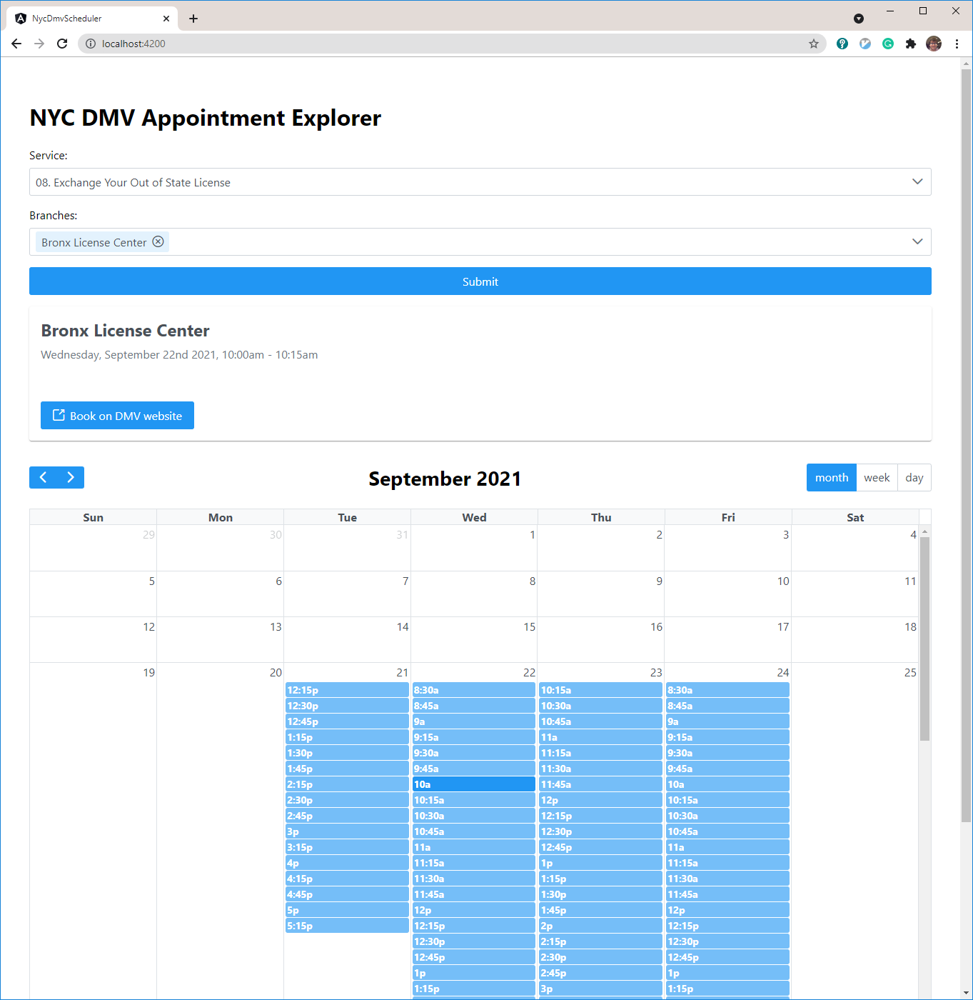

# NYC DMV Appointment Explorer

Simple Angular app to view upcoming NYC DMV appointments on a calendar. I made this to help me find the earliest appointment amongst multiple branches without having to check each one individually.

## Development server

Run `ng serve --proxy-config proxy.confg.json` for a dev server. Navigate to `http://localhost:4200/`. The app will automatically reload if you change any of the source files.

## Important notes

- By default, this app waits 2 seconds after each API call. This is to ensure it doesn't send requests too fast. This can be modified (`API_CALL_DELAY_MS`), but be reasonable!
- If the service you select isn't available at one of the selected branches, it will fail silently.
- This is only for visualizing bookings. You still have to navigate to the DMV website to reserve a slot. 

## Code scaffolding

Run `ng generate component component-name` to generate a new component. You can also use `ng generate directive|pipe|service|class|guard|interface|enum|module`.

## Build

Run `ng build` to build the project. The build artifacts will be stored in the `dist/` directory.

## Running unit tests

Run `ng test` to execute the unit tests via [Karma](https://karma-runner.github.io).

## Running end-to-end tests

Run `ng e1e` to execute the end-to-end tests via a platform of your choice. To use this command, you need to first add a package that implements end-to-end testing capabilities.
